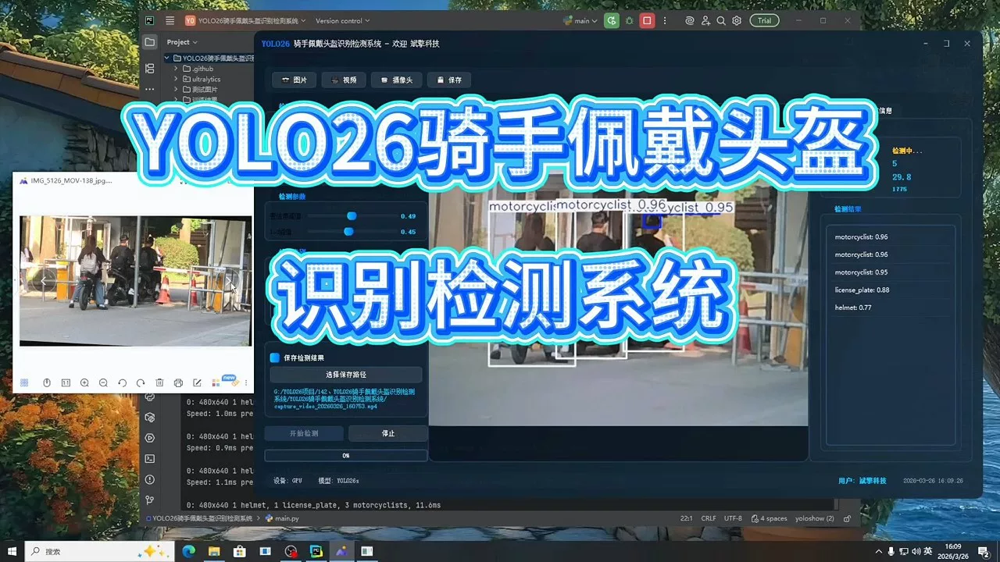
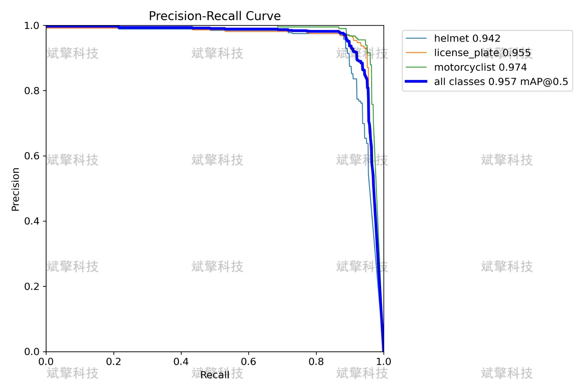
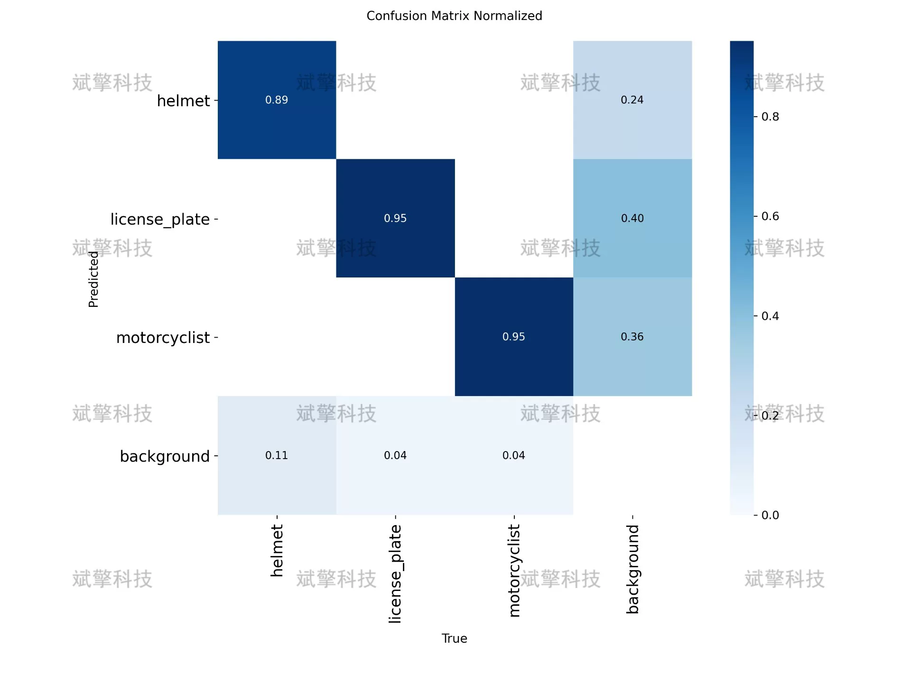
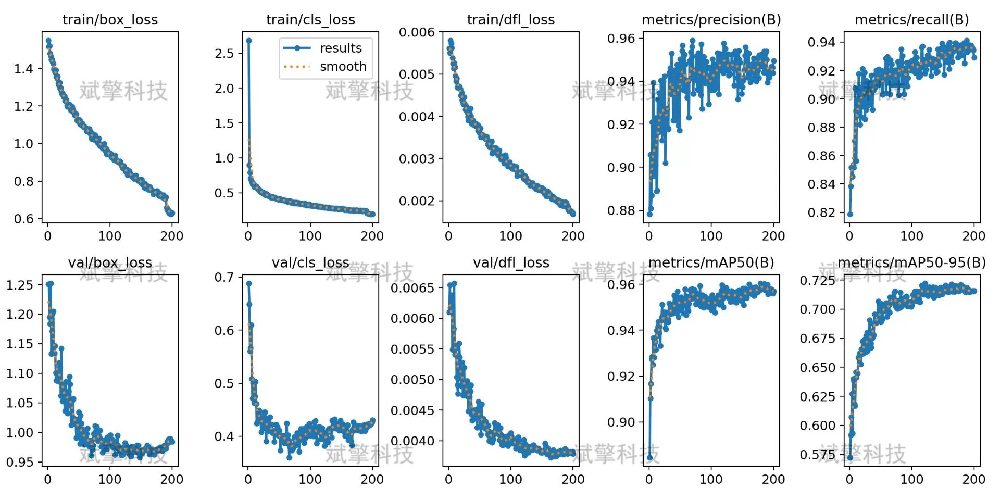
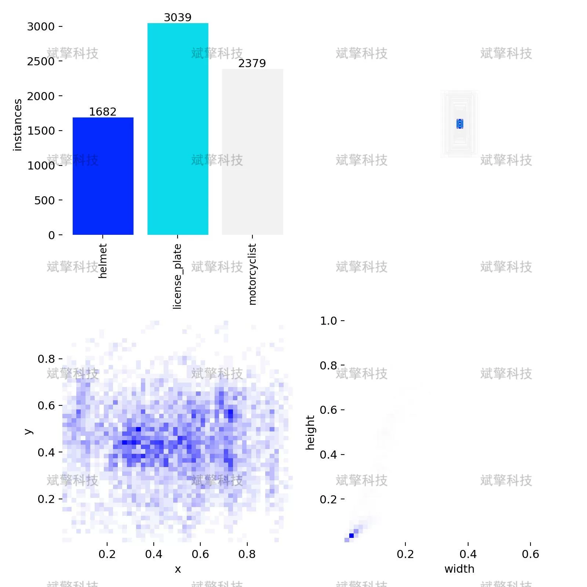
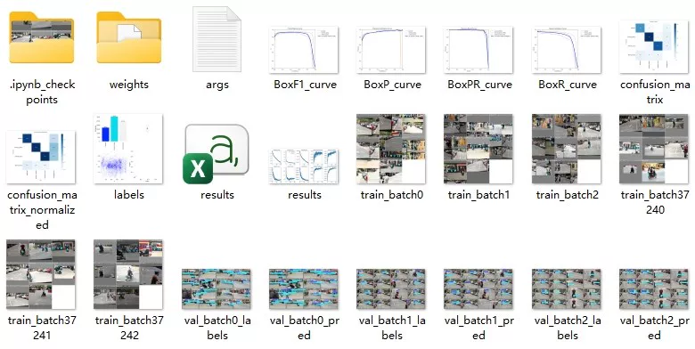
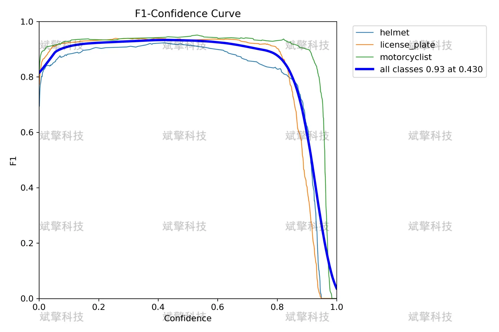
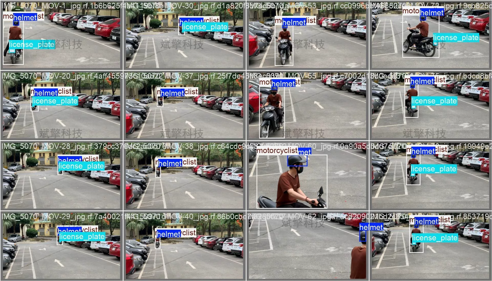
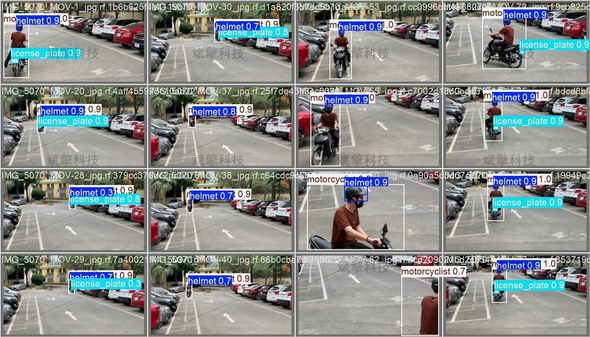

# YOLO26 rider helmet detection system | source code

## Body

YOLO26 Driver Helmet Detection System | Source Code: Detecting Drivers, Helmets, and License Plates with YOLO26 to Support Intelligent Traffic Supervision

With the popularity of two-wheeled vehicles such as motorcycles and electric bikes, the issue of traffic safety for drivers has increasingly become a focus. Among these, the correct wearing of helmets is key to ensuring the safety of drivers. However, traditional manual inspection methods are inefficient and difficult to achieve comprehensive and large-scale supervision 24/7. Therefore, this paper designs and implements a driver helmet detection system based on the YOLO object detection algorithm. This system can simultaneously detect three categories of targets: drivers, helmets, and license plates, providing intelligent supervision tools for traffic management departments. The system uses YOLO26 as the foundational framework, training on 1563 images, validating on 140 images, and testing on 100 images. Experimental results show that the model achieves an mAP@0.5 of 0.957 on the test set, with the highest detection accuracy for the driver category reaching 0.974, followed by 0.942 for helmets and 0.955 for license plates. The system demonstrates good detection performance and meets practical application needs.

The dataset consists of a total of 1803 labeled images, divided approximately at a ratio of 8:1:1 into:
Training set: 1563 images used for model training
Validation set: 140 images used for model tuning and validation
Test set: 100 images used for final performance evaluation

According to the detection task requirements, the dataset includes three target categories:
helmet (Helmets): Safety helmets worn by drivers
license_plate (License Plates): License plate numbers of motorcycles or electric bicycles
motorcyclist (Drivers): The driver themselves riding two-wheeled vehicles

Free reservation for remote installation. Unsuccessful full refund.
Purchase comes with the following resources (accessible through Baidu Cloud):
YOLO recognition detection project complete source code
YOLO format datasets
Training code + UI interface code
Trained model + result images
Software installer
Add WeChat to make a reservation for remote installation (automatically displayed WeChat ID after purchase) - Unsuccessful, full refund guaranteed

⚙️ Core functionality modules
Detection capabilities
    Image detection: Upon upload, returns detection boxes + category information
    Video detection: Supports video files, analyzing frames accurately
    Camera real-time detection: Integrates USB cameras for dynamic monitoring
Interaction and control
    Target selection: Choose one or more categories for detection
    Parameter adjustment: Adjustable confidence threshold & IoU threshold, flexible control of precision
    Result saving: Save images/videos/camera detection results in one click
System and data
    User login registration: Supports password strength checking + encryption storage
    Log recording: Records operation and error information automatically (timestamped)

## Images

## Payment

Here is a pay link on Stripe ( https://buy.stripe.com/3cs8yP7sY87d0vu9AB ). Please contact me lonlonago@foxmail.com after funding $89, and I will send you a complete data files , thank you!

